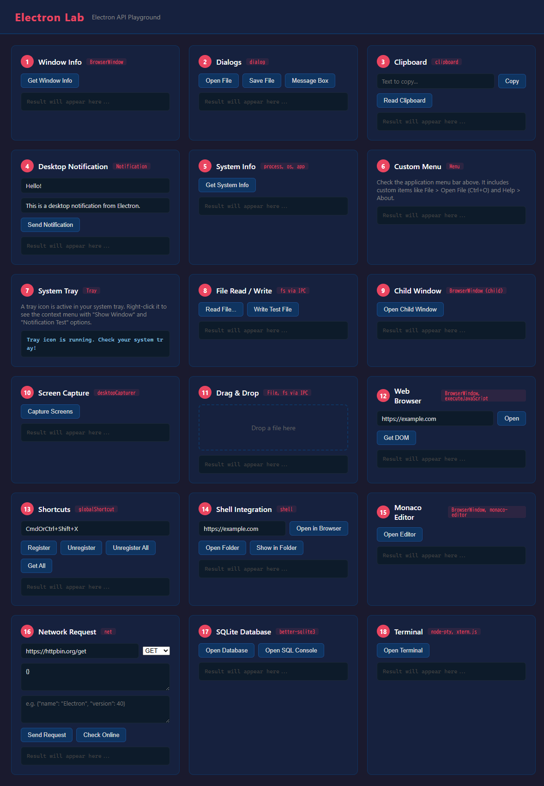
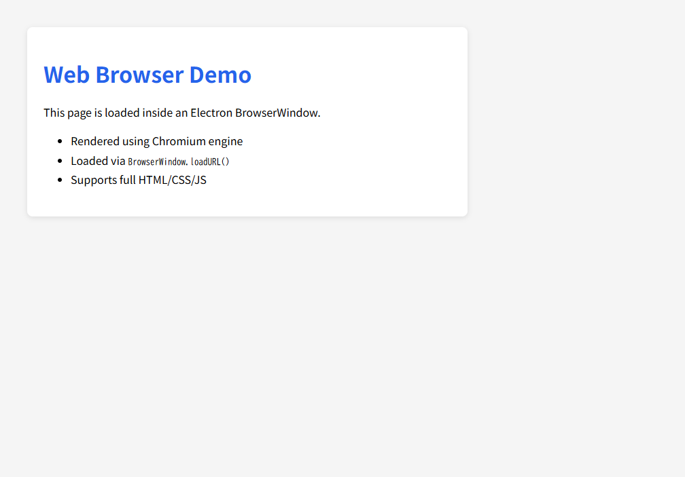
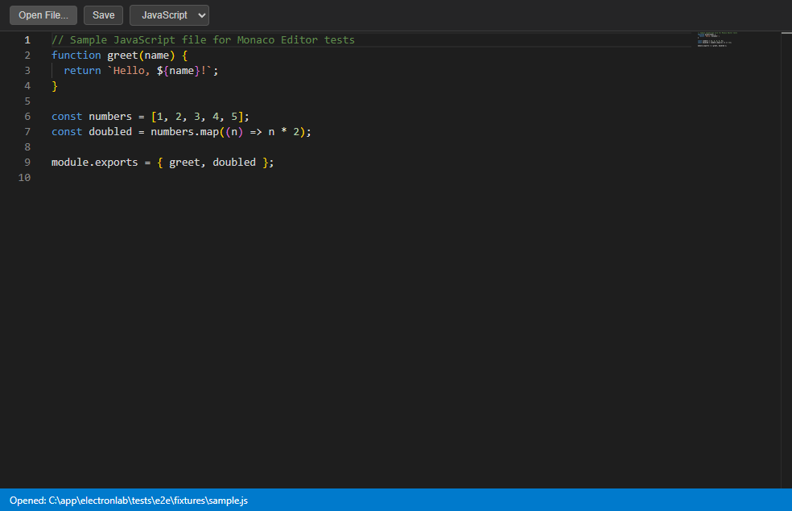
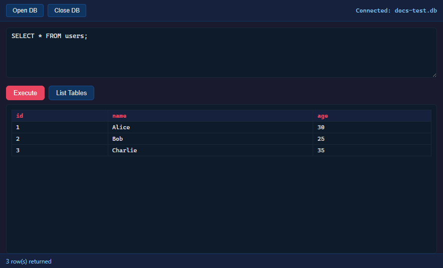
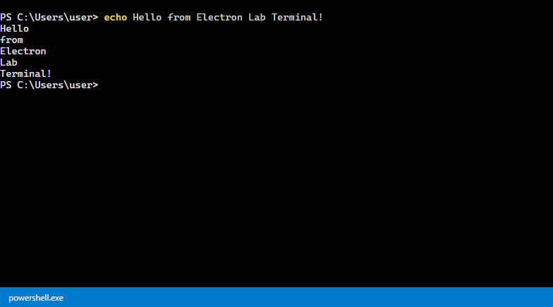

# Electron Lab - Features

Electron Lab は Electron v40.x の主要 API をデモするアプリケーションです。
各機能はカード形式の UI で提供され、ボタン操作で動作を確認できます。

## Overview

メイン画面には全機能がカード形式で一覧表示されます。

---

## #12 Web Browser

**使用 API**: `BrowserWindow`, `webContents.loadURL()`

任意の URL を Electron の BrowserWindow で開きます。
DOM の取得も可能で、簡易的な Web スクレイピングに利用できます。

---

## #15 Monaco Editor

**使用 API**: `BrowserWindow`, `ipcMain.handle()`, `dialog`

VS Code と同じエディタエンジン（Monaco Editor）を子ウィンドウで起動します。
ファイルの読み込み・保存、シンタックスハイライト、言語切り替えに対応。

---

## #17 SQLite Database

**使用 API**: `better-sqlite3`, `ipcMain.handle()`

SQLite データベースの作成・接続と、SQL コンソールでのクエリ実行機能を提供します。
CREATE TABLE、INSERT、SELECT などの基本的な SQL 操作をインタラクティブに実行できます。

---

## #18 Terminal

**使用 API**: `node-pty`, `xterm.js`, `BrowserWindow`, `ipcMain`

VS Code のようにアプリ内にインタラクティブなターミナルを組み込みます。
xterm.js（ターミナル UI）+ node-pty（疑似端末）を使い、子ウィンドウで実際のシェルを操作可能です。
ウィンドウリサイズに自動追従し、プロセス終了時のクリーンアップも実装済み。

